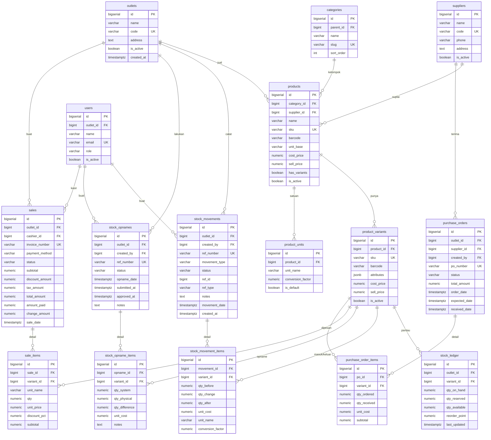
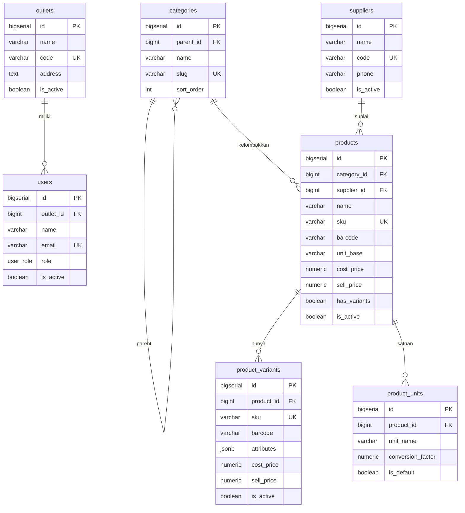
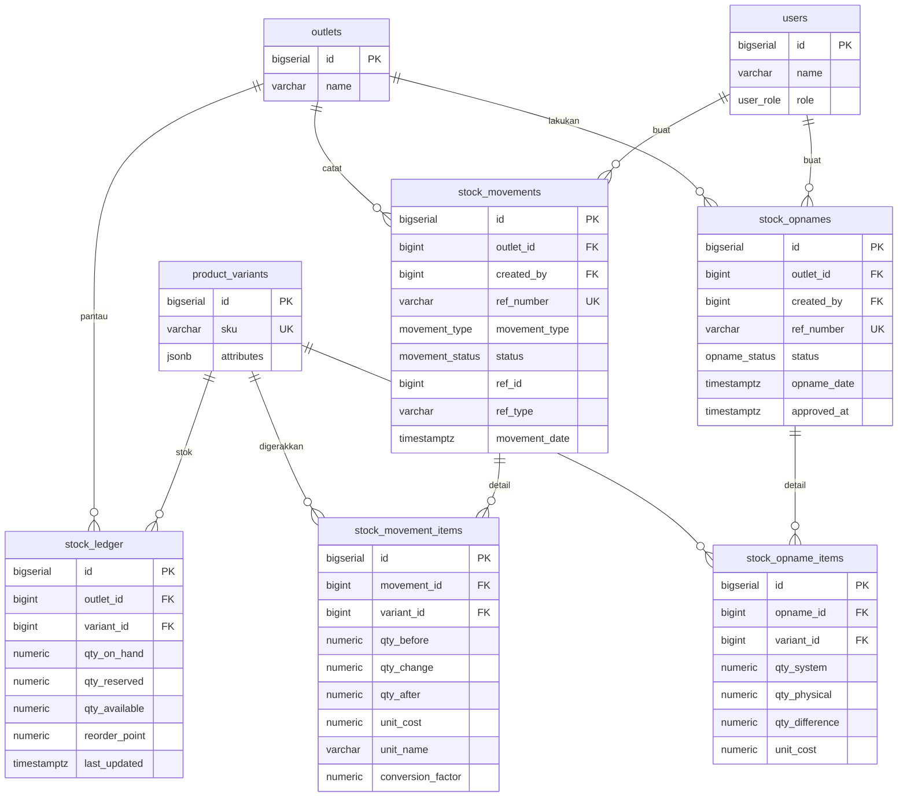
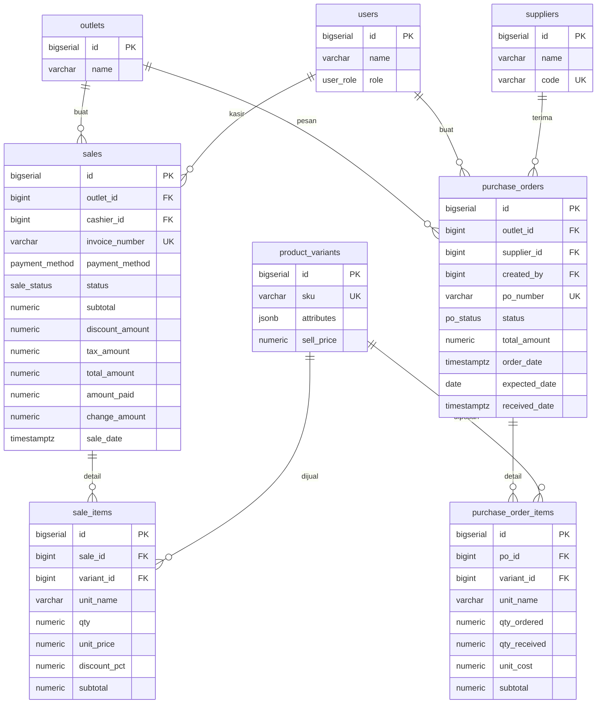

# Dokumen Persyaratan Produk (PRD): POS UI

**Versi:** 1.0  
**Status:** [Draft]  
**Pemilik:** [Nama Product Manager]  
**Tanggal:** [2026-06-15]

---

## 1. Ringkasan Eksekutif
### 1.1 Tujuan

membuat aplikasi pos yang bisa di manage dari sisi penjualan dan juga bisa melakukan stok masuk, stok keluar, dan stok opname dan bisa di track hasil dari semua penjualan bisa difilter dari untung dan rugi nya. dan juga ada report secara berkala

### 1.2 Visi & Penyelarasan Strategis
Bagaimana proyek ini selaras dengan tujuan jangka panjang perusahaan atau OKR kuartal saat ini?

---

## 2. Target Audiens & Persona
| Persona | Deskripsi | Tujuan | Masalah Utama |
| :--- | :--- | :--- | :--- |
| [Admin] | Tim operasional internal | Mengelola data pengguna | Pelaporan manual memakan waktu |
| [Operator] | operator | Transaksi yang aman | Latensi tinggi saat checkout |

---

## 3. Persyaratan Fungsional
### 3.1 User Stories
| ID | User Story | Prioritas | Kriteria Penerimaan |
| :--- | :--- | :--- | :--- |
| US-01 | Sebagai user, saya ingin masuk via SSO... | P0 (Wajib) | 1. Berhasil dengan Okta, 2. Muncul MFA |
| US-02 | Sebagai user, saya ingin ekspor laporan... | P1 (Penting) | 1. Format CSV, 2. Maks 50rb baris |

### 3.2 Cakupan (Scope) & Di Luar Cakupan
*   **Dalam Cakupan:** Fitur A, Fitur B, Integrasi dengan Sistem X.
*   **Di Luar Cakupan:** Dukungan Aplikasi Mobile (Fase 2), Migrasi data lama.

---

## 4. Persyaratan Non-Fungsional
*   **Performa:** Pemuatan halaman < 2 detik di bawah 1000 pengguna bersamaan.
*   **Keamanan:** Enkripsi data (AES-256) dan transmisi (TLS 1.3).
*   **Kepatuhan:** Log yang patuh terhadap regulasi GDPR/PDP.
*   **Skalabilitas:** Mendukung penskalaan horizontal untuk microservices.

---

## 5. Arsitektur Teknis & Integrasi
### 5.1 Diagram Sistem

#### Diagram Master Data

#### Diagram Management Stock

#### Diagram Transaksi Penjualan

  

### 5.2 Dependensi Eksternal
*   Payment Gateway Pihak Ketiga (Xendit/Midtrans).
*   API Layanan Pelanggan Internal.

---

## 6. Pengalaman Pengguna (UX) & Desain
*   **Alur Pengguna:** [Tautan ke Diagram Alur Pengguna]
*   **Wireframes/Figma:** [Tautan ke Prototipe Desain]
*   **Prinsip Desain:** Konsisten dengan Design System Perusahaan.

---

## 7. Metrik Keberhasilan (KPI)
*   **Tingkat Adopsi:** % pengguna yang menyelesaikan onboarding dalam 7 hari.
*   **Efisiensi:** Pengurangan pemrosesan tiket manual sebesar 30%.
*   **Stabilitas:** 99,9% Uptime untuk layanan inti.

---

## 8. Roadmap & Rencana Rilis
*   **Milestone 1:** MVP Beta (Q3 2026)
*   **Milestone 2:** Rilis Penuh (Q4 2026)

---

## 9. Risiko & Asumsi
*   **Asumsi:** Tim API internal menyelesaikan layanan autentikasi pada bulan Juli.
*   **Risiko:** Potensi penundaan dalam audit keamanan pihak ketiga.